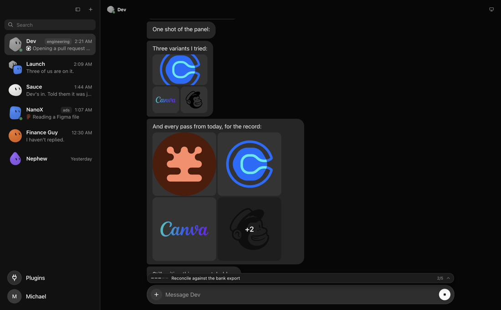
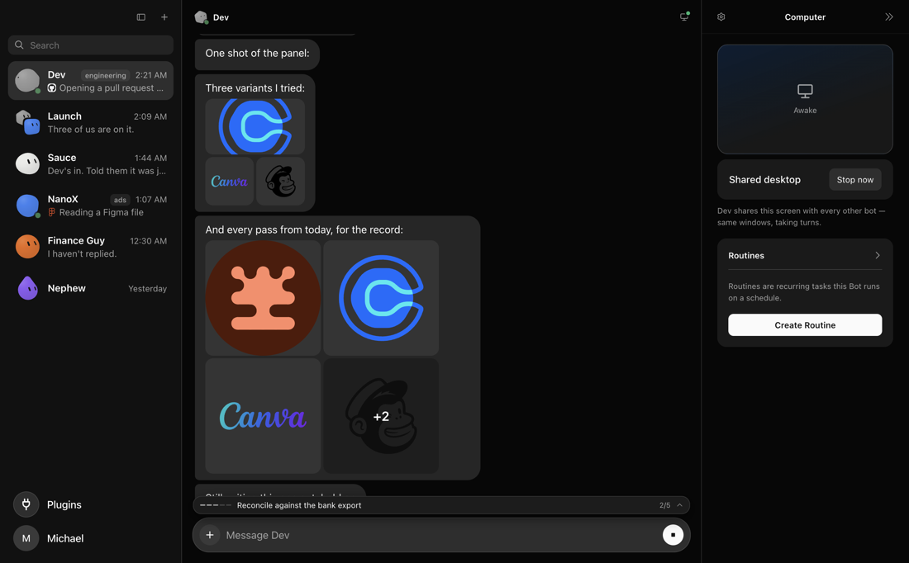
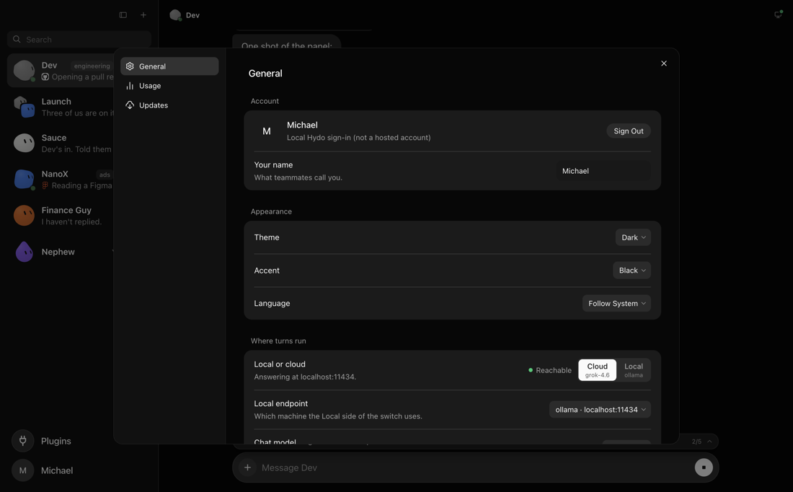
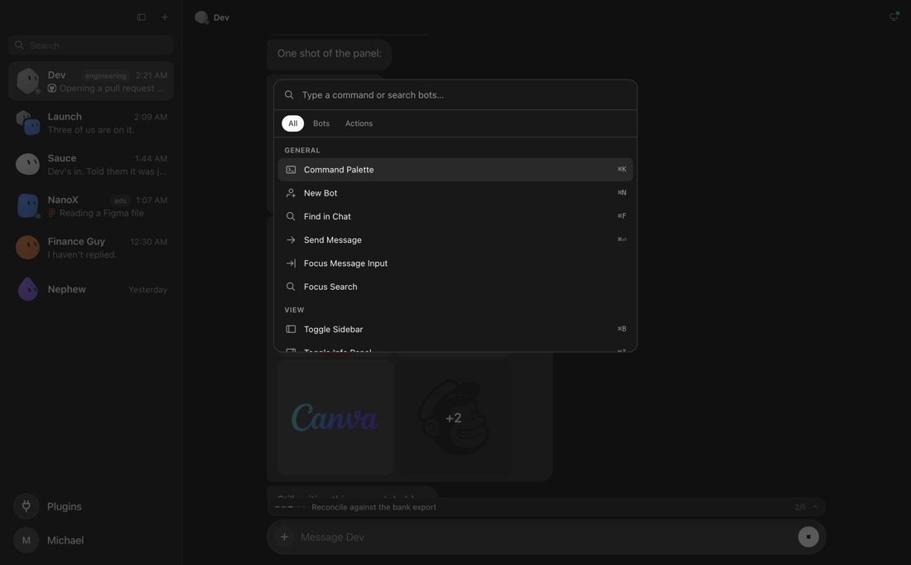
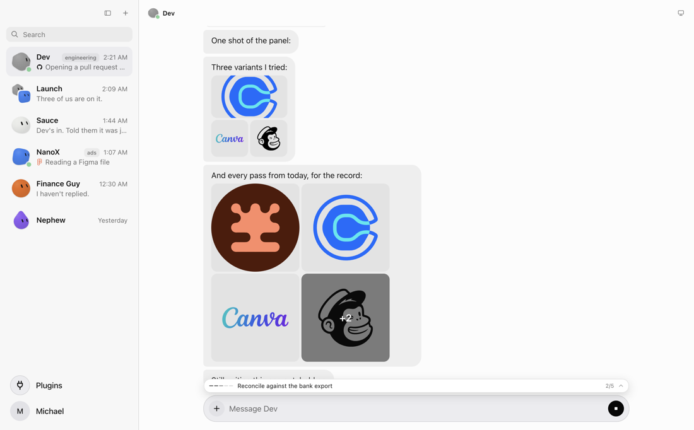
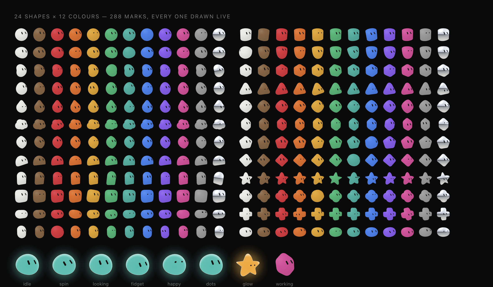

# Hydo — an open Grok Bot

**A team of AI teammates on your own machine. Open-source, MIT, and a drop-in alternative to Grok Bot's desktop client — running on Hermes Agent and your own hardware instead of someone else's.**

Grok Bot gave people the right idea: not one chat window, but a roster of named bots that keep working while you get on with something else. This is that idea, open, on your desk, with the model of your choosing — Grok 4.6 by default, any OpenAI-compatible endpoint (llama.cpp, LM Studio, Ollama, vLLM) when you would rather it never left the building.

Each teammate has its own memory, its own workspace on disk, its own tools and its own face. You talk to them in threads, they talk to each other in channels, and they get on with things on a schedule while you are not looking.

**Why you might want this instead**

- **Your machine, your model.** Cloud or local per teammate, switchable per session, and it asks before it moves your work somewhere else.
- **Real teammates, not tabs.** Named, persistent, with memory that survives restarts, and a shared team memory they all read.
- **A channel that does not cost six turns to stay quiet.** Members are woken, not polled: silence is free.
- **One shared computer.** A single Ascii box the whole roster drives, billed by the second and stopped when idle.
- **Nothing hidden.** MIT, no telemetry, no account. `npm test` is 119 suites and they assert behaviour, not vibes.

If you came here looking for an **open-source Grok Bot alternative**, a **Grok Bot for Mac you can self-host**, a **multi-agent desktop app** for **Hermes Agent**, or a way to run **local LLM agents** (llama.cpp, LM Studio, Ollama, vLLM) with a real roster and a shared computer — that is what this is.

Electron 42, React 19, Vite. Entry is `electron/main.cjs`; the renderer lives in `src/`.

## Screenshots

| | |
| --- | --- |
|  Main chat, sidebar roster |  The shared machine, in the Computer rail |
|  Settings — the Cloud/Local switch |  Command palette (mod+K) |

Light theme, same screen:



Captured against the mock fixture (`?mock=1`) — a populated roster with no real personal data, not a live account.

## How this differs from Grok Bot, and from a plain Hermes bot

Three things get confused with each other, so here they are side by side.

**Grok Bot** is xAI's desktop client: a roster of bots, a shared computer, a scheduler. Closed, hosted, and the model is xAI's. It is the product this is modelled on, and it got the shape right.

**A Hermes bot** is one agent in a terminal. Enormously capable — tools, subagents, skills, memory, checkpoints — and completely unaware that any other agent exists. No roster, no rooms, nothing that keeps running when you close the window.

**Hydo** is the roster around Hermes. Each teammate is its own Hermes profile with its own memory, workspace, tools and config; Hydo owns everything between them — who exists, who can talk to whom, who wakes up when, and which of them is currently allowed to touch the shared machine.

| | Grok Bot | Hermes on its own | Hydo |
| --- | --- | --- | --- |
| Where turns run | xAI's servers | your machine | your machine |
| Model | Grok | anything | Grok 4.6 by default, or your own endpoint, per teammate |
| Teammates | yes | one agent | yes, each an isolated profile |
| Rooms | group chats | none | channels + DMs, wake-based |
| Shared computer | yes | no | yes, one box, billed per second |
| Runs when you close it | yes | no | routines while the app is open |
| Source | closed | open | open, MIT |

**Why Hermes, and not a raw API.** A chat completion is a sentence; a teammate is a process. Hermes brings the parts that are tedious and easy to get subtly wrong: a real tool loop with approvals, subagents, skills, checkpointed file edits you can roll back, native compaction when a context fills, and per-profile isolation so one teammate's memory and MCP servers are genuinely not another's. Building that again on top of `/v1/chat/completions` would be most of a year, and the result would be a worse Hermes.

What Hydo adds is precisely what Hermes does not have, because a single-agent CLI has no reason to: identity across sessions, a roster, rooms with wake semantics, a shared machine with a lease on it, and a UI where you can watch a teammate work and stop it.

## What makes it different

- **Runs on your hardware if you want it to.** Point it at any OpenAI-compatible endpoint — Unsloth, llama.cpp, LM Studio, Ollama, vLLM — and switch between that and a hosted model with one control, per teammate. The app tells you honestly whether your endpoint is answering *before* you send, because a local server that is off looks exactly like a broken model. If it is down it asks before running your message somewhere else.
- **Silence is free.** A channel wakes its members once, concurrently, and a second turn only happens when someone is actually addressed by name. Six quiet members cost six turns, not eighteen.
- **One shared Linux machine for the whole team.** Files, installed software and browser logins live on its disk, so a teammate that signs into something once leaves it signed in for the next one. Billed by the second, switched off when idle.
- **It says what it is doing.** "Opening a pull request on GitHub", with the real brand mark — read from the actual tool call, not guessed.
- **288 marks, drawn live.** 24 shapes × 12 colours, each one blinking, breathing and reacting on its own clock. Not a sprite sheet.
- **Everything is measured.** `docs/` records what things cost and what was tested versus merely read. Several entries are corrections of earlier claims that turned out to be wrong.



Turns run on [Hermes Agent](https://hermes-agent.nousresearch.com) over its `tui_gateway` JSON-RPC protocol (`electron/hermes-gateway.cjs`, `docs/HERMES-GATEWAY.md`). OpenRouter is a fallback only, used when Hermes is unavailable.

## Not affiliated with xAI

Hydo is an independent project. The layout and interaction model take inspiration from Grok Bot's desktop client; the name, the code and the backend are its own, and no user-facing string in the app says "Grok" except where it truthfully names xAI's CLI as a coding harness. Contributors: keep it that way.

## Requirements

- **macOS**, and Node (Electron 42 bundles its own Chromium/Node; `npm install` needs a system Node to run `npm` itself).
- **[Hermes Agent](https://hermes-agent.nousresearch.com)** installed at `~/.hermes/hermes-agent` — turns run on its `tui_gateway` JSON-RPC protocol (`electron/hermes-gateway.cjs`). Without it, Hydo has no agent to talk to.
- **A model to run turns on** — either a hosted model through Hermes/OpenRouter, or your own OpenAI-compatible endpoint (Unsloth, LM Studio, Ollama, anything that speaks `/v1/chat/completions`) reachable from the machine Hydo runs on. See `docs/LOCAL-MODEL.md` for exactly how that wiring works and what it costs on real hardware.
- The shared-computer feature (the Computer rail, one Linux box the whole team uses) needs the `box` CLI and an account — optional, and billed by the second. See `docs/BOX.md` for the real numbers.

## Install & run

```
npm install
npm start
```

`npm start` runs Vite on `127.0.0.1:5173` then launches Electron (`package.json` `dev` script).

- Tests: `npm test` (`scripts/test.cjs` and the rest of the suite)
- Production renderer: `npm run build` (output in `dist/`), packaged app: `npm run app`
- Distributable build: `npm run dist` (electron-builder)

## How it is wired

Electron loads the Vite URL in development and `dist/index.html` when packaged. `electron/preload.cjs` exposes `window.hydo` to the renderer. `src/App.jsx` / `src/screens/Shell.jsx` drive the UI. `electron/store.cjs` owns bots, channels, messages, and turn orchestration. Each bot gets a Hermes session through `electron/hermes-gateway.cjs`. Plugins are Hermes MCP servers, adapted in `electron/hermes-plugins.cjs`. Keyboard chords live in `src/lib/shortcuts.js`.

A channel fans a user message to every member. Each member takes its own Hermes turn. The channel prompt tells members with nothing to add to reply `SKIP` so they stay quiet. Bots can ping other bots. Messages support reactions, reply-to, attachments, approvals ("ask before acting"), and clarify questions. Routines are stored per bot. Command palette is mod+K. Find in chat is mod+F.

## Keyboard shortcuts

From `src/lib/shortcuts.js` (`mod` is Command on macOS, Ctrl elsewhere):

| Chord | Action |
| --- | --- |
| mod+K | Command palette |
| mod+F | Find in chat |
| mod+N | New bot |
| mod+Enter | Send |
| mod+, | Settings |
| mod+B | Toggle sidebar |
| mod+I, mod+L | Toggle info panel |
| mod+[ / mod+] | Back / forward |
| alt+Up / alt+Down | Previous / next bot |

## State

Persisted at `~/Library/Application Support/hydo/state.json` (Electron `app.getPath("userData")` + `state.json` in `electron/store.cjs`).

## UI without Electron

For renderer work only:

```
npx vite
```

Open `http://localhost:5173/?mock=1`. That query flag, plus `import.meta.env.DEV` and no `window.hydo`, installs `src/lib/devmock.js`. The mock never runs in Electron or in a production build.
